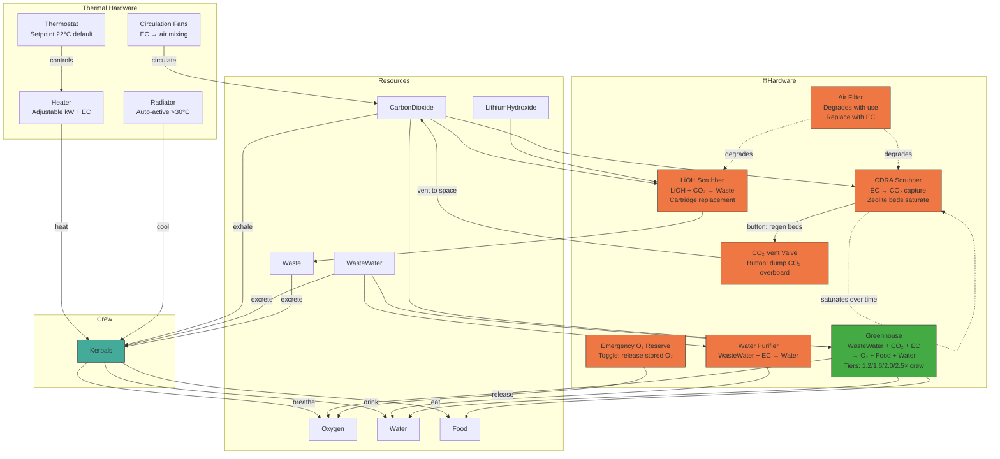

```mermaid
graph TB
    subgraph Crew["Crew"]
        K[Kerbals]
    end

    subgraph Resources["Resources"]
        O2[Oxygen]
        CO2[CarbonDioxide]
        H2O[Water]
        WW[WasteWater]
        Food[Food]
        Waste[Waste]
        LiOH[LithiumHydroxide]
    end

    subgraph Hardware["⚙Hardware"]
        CDRA[CDRA Scrubber<br/>EC → CO₂ capture<br/>Zeolite beds saturate]
        LiOHScrub[LiOH Scrubber<br/>LiOH + CO₂ → Waste<br/>Cartridge replacement]
        H2OPurifier[Water Purifier<br/>WasteWater + EC → Water]
        Greenhouse[Greenhouse<br/>WasteWater + CO₂ + EC<br/>→ O₂ + Food + Water<br/>Tiers: 1.2/1.6/2.0/2.5× crew]
        CO2Vent[CO₂ Vent Valve<br/>Button: dump CO₂ overboard]
        EmergO2[Emergency O₂ Reserve<br/>Toggle: release stored O₂]
        AirFilter[Air Filter<br/>Degrades with use<br/>Replace with EC]
    end

    subgraph Thermal["Thermal Hardware"]
        Heater[Heater<br/>Adjustable kW + EC]
        Radiator[Radiator<br/>Auto-active >30°C]
        Thermostat[Thermostat<br/>Setpoint 22°C default]
        Fans[Circulation Fans<br/>EC → air mixing]
    end

    K -->|breathe| O2
    K -->|drink| H2O
    K -->|eat| Food
    CO2 -->|exhale| K
    WW -->|excrete| K
    Waste -->|excrete| K

    CO2 --> CDRA
    CDRA -->|button: regen beds| CO2Vent
    CDRA -.->|saturates over time| CDRA

    CO2 --> LiOHScrub
    LiOH --> LiOHScrub
    LiOHScrub --> Waste

    WW --> H2OPurifier
    H2OPurifier --> H2O

    WW --> Greenhouse
    CO2 --> Greenhouse
    Greenhouse --> O2
    Greenhouse --> Food
    Greenhouse --> H2O

    EmergO2 -->|release| O2

    CO2Vent -->|vent to space| CO2

    AirFilter -.->|degrades| CDRA
    AirFilter -.->|degrades| LiOHScrub

    Heater -->|heat| K
    Radiator -->|cool| K
    Fans -->|circulate| CO2
    Thermostat -->|controls| Heater

    style K fill:#4a9,stroke:#333
    style CDRA fill:#e74,stroke:#333
    style LiOHScrub fill:#e74,stroke:#333
    style H2OPurifier fill:#e74,stroke:#333
    style Greenhouse fill:#4a4,stroke:#333
    style CO2Vent fill:#e74,stroke:#333
    style EmergO2 fill:#e74,stroke:#333
    style AirFilter fill:#e74,stroke:#333
```
