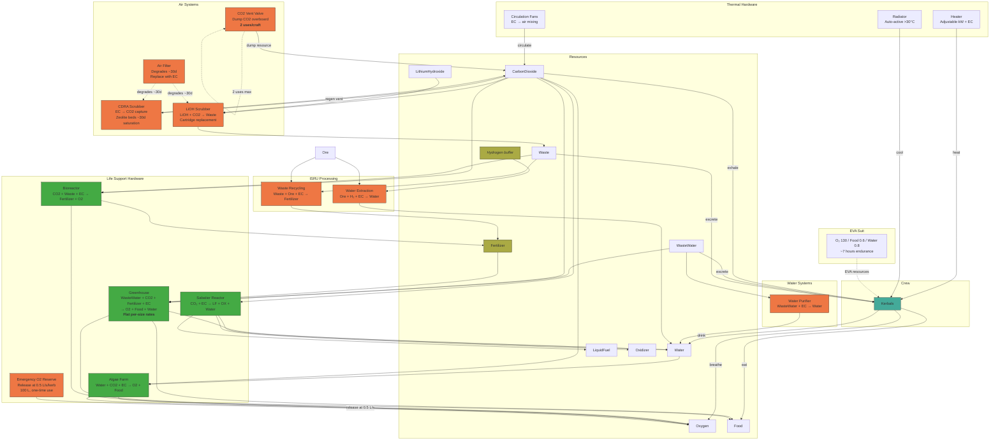

```mermaid
graph TB
    subgraph Crew["Crew"]
        K[Kerbals]
    end

    subgraph Resources["Resources"]
        O2[Oxygen]
        CO2[CarbonDioxide]
        H2O[Water]
        WW[WasteWater]
        Food[Food]
        Waste[Waste]
        LiOH[LithiumHydroxide]
        Fert[Fertilizer]
        H2[<i>Hydrogen buffer</i>]
        LF[LiquidFuel]
        OX[Oxidizer]
    end

    subgraph Air["Air Systems"]
        CDRA[CDRA Scrubber<br/>EC → CO2 capture<br/>Zeolite beds ~30d saturation]
        LiOHScrub[LiOH Scrubber<br/>LiOH + CO2 → Waste<br/>Cartridge replacement]
        CO2Vent[CO2 Vent Valve<br/>Dump CO2 overboard<br/><b>2 uses/craft</b>]
        AirFilter[Air Filter<br/>Degrades ~30d<br/>Replace with EC]
    end

    subgraph WaterSys["Water Systems"]
        H2OPurifier[Water Purifier<br/>WasteWater + EC → Water]
    end

    subgraph LifeSupport["Life Support Hardware"]
        Greenhouse[Greenhouse<br/>WasteWater + CO2 + Fertilizer + EC<br/>→ O2 + Food + Water<br/><b>Flat per-size rates</b>]
        AlgaeFarm[Algae Farm<br/>Water + CO2 + EC → O2 + Food]
        Bioreactor[Bioreactor<br/>CO2 + Waste + EC → Fertilizer + O2]
        Sabatier[Sabatier Reactor<br/>CO₂ + EC → LF + OX + Water]
        EmergO2[Emergency O2 Reserve<br/>Release at 0.5 L/s/kerb<br/>100 L, one-time use]
    end

    subgraph ISRU["ISRU Processing"]
        WaterExtract[Water Extraction<br/>Ore + H₂ + EC → Water]
        WasteRecycle[Waste Recycling<br/>Waste + Ore + EC → Fertilizer]
    end

    subgraph Thermal["Thermal Hardware"]
        Heater[Heater<br/>Adjustable kW + EC]
        Radiator[Radiator<br/>Auto-active >30°C]
        Fans[Circulation Fans<br/>EC → air mixing]
    end

    subgraph EVA["EVA Suit"]
        EVARes[O₂ 130 / Food 0.6 / Water 0.8<br/>~7 hours endurance]
    end

    K -->|breathe| O2
    K -->|drink| H2O
    K -->|eat| Food
    CO2 -->|exhale| K
    WW -->|excrete| K
    Waste -->|excrete| K

    CO2 --> CDRA
    CDRA -->|regen vent| CO2

    CO2 --> LiOHScrub
    LiOH --> LiOHScrub
    LiOHScrub --> Waste

    CO2Vent -->|dump resource| CO2
    CO2Vent -.->|2 uses max| CO2Vent

    WW --> H2OPurifier
    H2OPurifier --> H2O

    WW --> Greenhouse
    CO2 --> Greenhouse
    Fert --> Greenhouse
    Greenhouse --> O2
    Greenhouse --> Food
    Greenhouse --> H2O

    H2O --> AlgaeFarm
    CO2 --> AlgaeFarm
    AlgaeFarm --> O2
    AlgaeFarm --> Food

    CO2 --> Bioreactor
    Waste --> Bioreactor
    Bioreactor --> Fert
    Bioreactor --> O2

    CO2 --> Sabatier
    Sabatier --> LF
    Sabatier --> OX
    Sabatier --> H2O

    Ore[Ore] --> WaterExtract
    H2 --> WaterExtract
    WaterExtract --> H2O

    Waste --> WasteRecycle
    Ore --> WasteRecycle
    WasteRecycle --> Fert

    EmergO2 -->|release at 0.5 L/s| O2

    AirFilter -.->|degrades ~30d| CDRA
    AirFilter -.->|degrades ~30d| LiOHScrub

    Heater -->|heat| K
    Radiator -->|cool| K
    Fans -->|circulate| CO2

    EVARes -.->|EVA resources| K

    style K fill:#4a9,stroke:#333
    style CDRA fill:#e74,stroke:#333
    style LiOHScrub fill:#e74,stroke:#333
    style H2OPurifier fill:#e74,stroke:#333
    style Greenhouse fill:#4a4,stroke:#333
    style AlgaeFarm fill:#4a4,stroke:#333
    style Bioreactor fill:#4a4,stroke:#333
    style Sabatier fill:#4a4,stroke:#333
    style WaterExtract fill:#e74,stroke:#333
    style WasteRecycle fill:#e74,stroke:#333
    style CO2Vent fill:#e74,stroke:#333
    style EmergO2 fill:#e74,stroke:#333
    style AirFilter fill:#e74,stroke:#333
    style Fert fill:#aa4,stroke:#333
    style H2 fill:#aa4,stroke:#333
```
